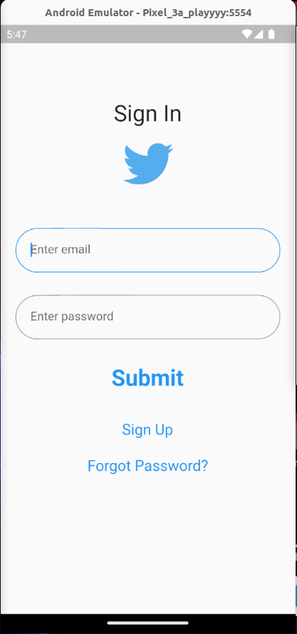

# 0x02. Flutter - Twitter clone: static part 1

### Welcome to Twitter Clone project! This Flutter-based app brings the essence of Twitter to life with its feature-rich design. Embrace the seamless sign-in, sign-up, and forgot password screens, ensuring a secure and smooth user experience. Navigate through the home page equipped with an intuitive drawer, reminiscent of the beloved Twitter app. The project incorporates custom text fields and flat buttons, enhancing the overall aesthetic and functionality. With this Twitter Clone, we present a captivating demonstration of Flutter expertise and thoughtful UI design, offering users a taste of the Twitter experience in a brand-new context

  
  
  
  
  

# 0x03. Flutter - Twitter Clone Static Part 2

## In this part of the Twitter Clone Project, i have  successfully implemented those features :

### Posts UI with Dummy Data: Created a UI displaying posts using dummy data, featuring profile avatars, usernames, post content, and interaction icons, wrapped in a scrollable list for user engagement.

### PostWidget: A customizable Flutter widget displaying a stylized social media post, including user avatar, username, verified badge, post content, and interaction icons, with dynamic data injection, encapsulating a post's visual representation.

  
  
  
  

# 0x04. Flutter - Twitter Clone Part 3 (Authentication)
### in this part of the Twitter Clone Project I've successfully implemented essential authentication features, encompassing user registration and login logic, robust password security, comprehensive error handling, and seamless logout functionality. The project's backbone is fortified by the integration of Firebase, which serves as the robust backend support system. This integration leverages Firebase Authentication for secure user identification and incorporates Firestore for streamlined management of user data.

## Key Features:

* #### User Model: Define a comprehensive User model with attributes such as key, userID, email, userName, displayName, imageUrl, followers, following, followersList, and followingList.

* #### Authentication Logic: Develop an Auth provider class that handles user authentication using Firebase. Implement methods like attemptSignUp for registration and attemptLogin for login, incorporating error handling for common scenarios.

* #### Firebase Integration: Utilize Firebase services, including FirebaseAuth and Firestore, to manage user authentication and store user data in a structured manner within the users collection.

* #### Password Security: Ensure password security by handling weak passwords, matching password confirmation, and avoiding email duplication during user registration.

### Error Handling: Implement an Errors enum to categorize and handle various authentication errors like password mismatch, weak password, email already in use, and more.

* #### Logout Functionality: Create a logout method within the Auth class to sign out users and navigate to the login screen, enhancing security and user management.

* #### Display User Data: Develop a getCurrentUserModel method that retrieves the current user's data from Firebase based on the user's UID. Use this data to display user information, such as name, username, followers count, and followings count, in the side menu.

# 0x05. Flutter - Twitter Clone Part 4

#### In this phase of the Twitter Clone project, user profiles were introduced, enhancing the overall user experience and interaction. The implementation of user profiles involved several crucial tasks and features:

### Profile Screen
##### A new screen, ProfileScreen, was created to display user profiles. Utilizing the getUserByID method, the screen fetched user data based on the provided userID. The screen's design included elements such as the user's bio, cover image, and interaction buttons.

### Edit Profile
##### The EditProfileScreen was introduced, allowing users to edit their profiles. After modifying profile properties, the "save" button triggered updates to the user's corresponding properties. This feature empowered users to personalize their profiles according to their preferences.

### Home Screen Enhancement
##### The home_screen.dart was enhanced with a floating action button featuring a plus icon, enabling users to navigate to the EditPostScreen for creating new posts.

### Create Post
##### A new screen, EditPostScreen, was developed, enabling users to compose and publish new posts. The screen incorporated a text field for post content, the current user's avatar, and a "tweet" button to publish the post.

### Post Model
##### The Post model was introduced, encompassing attributes such as text, userID, likeCount, and likeList. The model formed the basis for creating and managing individual posts.

### Post Widget Enhancement
###### The PostWidget was enhanced to display post content dynamically using the Post model. Interaction elements, such as avatars and display names, were made clickable, allowing users to navigate to profile screens.

##### These features collectively enriched the user's engagement with the app, enabling them to explore and interact with user profiles, create posts, and personalize their own profiles, thereby replicating key aspects of the Twitter experience.

  
  
  
  

### Made by [Jaafar Fares](https://jaafarfares.github.io/) for [Holberton School](https://www.holbertonschool.com/)

