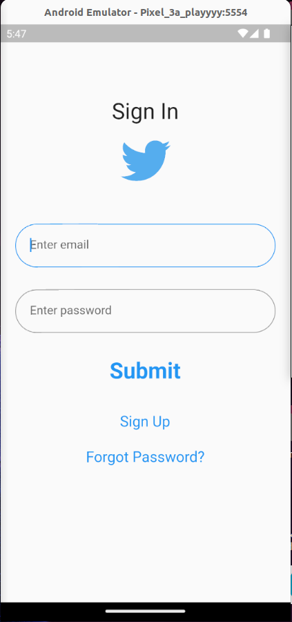

# 0x02. Flutter - Twitter clone: static part 1

### Welcome to Twitter Clone project! This Flutter-based app brings the essence of Twitter to life with its feature-rich design. Embrace the seamless sign-in, sign-up, and forgot password screens, ensuring a secure and smooth user experience. Navigate through the home page equipped with an intuitive drawer, reminiscent of the beloved Twitter app. The project incorporates custom text fields and flat buttons, enhancing the overall aesthetic and functionality. With this Twitter Clone, we present a captivating demonstration of Flutter expertise and thoughtful UI design, offering users a taste of the Twitter experience in a brand-new context

# 0x03. Flutter - Twitter Clone Static Part 2

## In this part of the Twitter Clone Project, i have  successfully implemented those features :

### Posts UI with Dummy Data: Created a UI displaying posts using dummy data, featuring profile avatars, usernames, post content, and interaction icons, wrapped in a scrollable list for user engagement.

### PostWidget: A customizable Flutter widget displaying a stylized social media post, including user avatar, username, verified badge, post content, and interaction icons, with dynamic data injection, encapsulating a post's visual representation.

### Made by [Jaafar Fares](https://jaafarfares.github.io/) for [Holberton School](https://www.holbertonschool.com/)

